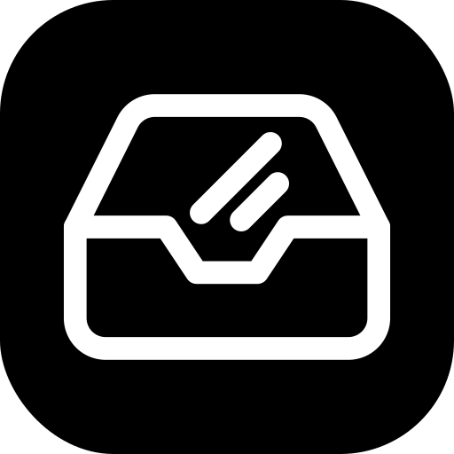

  
  <h1 align="center">Shadcn Weekly</h1>

  A curated weekly newsletter for the <a href="https://ui.shadcn.com/">shadcn/ui</a> ecosystem. 
  News, tutorials, projects, and tools — delivered every Monday.

  
  
  

## Sponsorship

Shadcn Weekly offers limited sponsorship placements. [View pricing and book a slot](https://shadcnweekly.com/sponsor).

| Placement                     | Price      |
| ----------------------------- | ---------- |
| 1st Sponsor                   | $100/issue |
| 1st Sponsor Bundle (4 issues) | $200       |
| 2nd Sponsor                   | $50/issue  |
| 2nd Sponsor Bundle (4 issues) | $100       |

## Contact

- **Email:** [hello@shadcnweekly.com](mailto:hello@shadcnweekly.com)
- **Twitter:** [@alaymanguy](https://x.com/alaymanguy)
- **Discord:** [Join the server](https://discord.com/invite/N6G36KhYK4)

## License

[MIT](LICENSE)
